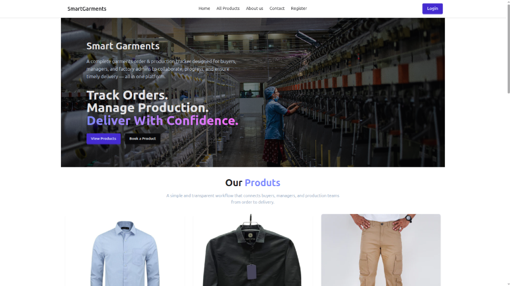

# Garments Order & Production Tracker System – Frontend

A modern, responsive, and role-based production management system built with **React Js**. This platform allows buyers to place garment orders, managers to manage products & approvals, and admins to control the entire system with analytics.

## Live Website
[Frontend Live site](https://garments-production-tracking-system.vercel.app/)

## Project Preview


## Project Purpose
This project is designed to help small and medium-sized garment factories:
- Track buyer orders
- Manage production workflow
- Monitor delivery status
- Control users and product visibility
- Visualize business data through analytics

## User Roles
- **Admin** – Full system control
- **Manager** – Product & Order Management
- **Buyer** – Order placement & tracking

---

## Key Features

### Public Features
- Modern animated Home Page (Framer Motion)
- All Products Page
- Product Search & Filter
- Login & Registration (Firebase Auth)
- Google / GitHub Login
- Dark / Light Theme
- Fully Responsive UI

### Buyer Dashboard
- My Orders
- Track Order Timeline
- Cancel Pending Orders
- View Profile & Suspend Feedback

### Manager Dashboard
- Add Product
- Manage Own Products
- Pending Orders
- Approve Orders
- Add Tracking Info
- Profile Management

### Admin Dashboard
- Manage Users (Role Update / Suspend)
- All Products (Update, Delete, Show on Home)
- All Orders (Filter & Status Control)
- Analytics Dashboard
- Charts (Bar, Line, Pie)

---

## Technologies Used

- React + Vite
- Tailwind CSS + Daisy UI
- HTML
- JavaScript
- Firebase Authentication

## Used Tools & Libraries
- React Router
- React Icons
- React Hook Form
- SweetAlert2
- react hot toast
- axios
- tanstack query
- Firebase JWT Authentication
- Framer Motion
- swiper
- Recharts


---

## Authentication
- Firebase Email/Password Login
- Google Login
- Role-based Protected Routes

---

## Project Timeline
- Started: 8 Dec 2025
- Completed: 23 Dec 2025
- Last updated: 20 Jan 2026

---

## Installation & Setup

1. Clone the repository:
   ```bash
   git clone https://github.com/nayem-ahmedz/repo-client.git
   ```
2. Navigate to the project folder:
   ```bash
   cd repo-client
   ```
3. Setup env vairables:
   ```bash
   copy .env.example to .env and fill
   ```
4. Install dependencies:
   ```bash
   npm install
   ```
5. Start the development server:
   ```bash
   npm run dev
   ```

---

## Environment Variables
Create `.env.local` file and add environment variables

```env
VITE_apiKey=your_firebase_key
VITE_authDomain=your_auth_domain
VITE_projectId=your_project_id
VITE_storageBucket=your_storage_bucket
VITE_messagingSenderId=your_messaging_id
VITE_appId=your_app_id
VITE_SERVER_URL=your_BACKEND_link
VITE_IMGBB_API_KEY=your_imagebb_api_key
```

---

## Developer Info

Name: Nayem Ahmed  
Role: Fullstack Web Developer (MERN Stack)  
Portfolio: https://nayem-ahmed.vercel.app  
GitHub: https://github.com/nayem-ahmedz  
LinkedIn: https://linkedin.com/in/nayem-ahmedz  

---
Feel free to contact me for any queries or collaboration.